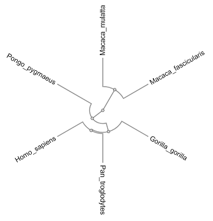

# compareMS2
compareMS2 calculates the global similarity between tandem mass spectrometry datasets.

[1. Introduction](#1-Introduction)  
&nbsp;&nbsp;&nbsp;&nbsp;&nbsp;[1.1 What is compareMS2?](#11-What-is-compareMS2)  
&nbsp;&nbsp;&nbsp;&nbsp;&nbsp;[1.2 How does compareMS2 differ from other tools?](#12-How-does-compareMS2-differ-from-other-tools)  
&nbsp;&nbsp;&nbsp;&nbsp;&nbsp;[1.3 What can compareMS2 be used for?](#13-What-can-compareMS2-be-used-for)  
[2. Installing compareMS2](#2-Installing-compareMS2)  
&nbsp;&nbsp;&nbsp;&nbsp;&nbsp;[2.1 Running compareMS2 in development mode](#21-Running-compareMS2-in-development-mode)  
&nbsp;&nbsp;&nbsp;&nbsp;&nbsp;[2.2 Building compareMS2](#22-Building-compareMS2)  
[3. Using compareMS2](#3-Using-compareMS2)  
&nbsp;&nbsp;&nbsp;&nbsp;&nbsp;[3.1 Configuring compareMS2](#31-Configuring-compareMS2)  
&nbsp;&nbsp;&nbsp;&nbsp;&nbsp;[3.2 Calculating distance matrices](#32-Calculating-distance-matrices)  
&nbsp;&nbsp;&nbsp;&nbsp;&nbsp;[3.3 Running compareMS2](#33-Running-compareMS2)  
&nbsp;&nbsp;&nbsp;&nbsp;&nbsp;[3.4 Molecular phylogenetics](#34-Molecular-phylogenetics)  
&nbsp;&nbsp;&nbsp;&nbsp;&nbsp;[3.5 Data quality control](#35-Data-quality-control)  
[4. Further reading](#4-Further-reading)  


## 1. Introduction

### 1.1 What is compareMS2?

compareMS2 is a tool for direct comparison of tandem mass spectrometry datasets, typically from liquid chromatography-tandem mass spectrometry (LC-MS/MS), defining similarity as a function of shared (similar) spectra and distance as the inverse of this similarity. Data with identical spectral content thus have similarity 1 and distance 0. The similarity of datasets with no similar spectra tend to 0 (distance +∞) as the size of the sets go to infinity. The extremes of none or all spectra being similar between two LC-MS/MS datasets are unlikely to occur in reality.

### 1.2 How does compareMS2 differ from other tools?
Though compareMS2 is not limited to tandem mass spectra of peptides, it has seen most application to this type of data. There are four broad categories of tools for the analysis of peptide tandem mass spectra in mass spectrometry-based proteomics based on what prior information they utilize. compareMS2 belongs to a class of tools that do not use existing sequence data or libraries of spectra assigned to a specific peptide sequence, but compare tandem mass spectra directly with other tandem mass spectra:

|                                     |      | (translated) genome sequences                    |                                                   |
| :---                                | :--- | :---                                             | :---                                              |
|                                     |      | +                                                | -                                                 |
| **prior/other tandem mass spectra** | +    | spectral libraries ([BiblioSpec](http://doi.org/10.1021/ac060279n), [SpectraST](http://doi.org/10.1002/pmic.200600625), ...)  | direct comparison (**[compareMS2](http://doi.org/10.1002/rcm.6162)**, [DISMS2](http://doi.org/10.1186/s12859-017-1514-2), ...)  |
|                                     | -    | database search ([Mascot](https://doi.org/10.1002/(SICI)1522-2683(19991201)20:18<3551::AID-ELPS3551>3.0.CO;2-2), [Comet](https://doi.org/10.1038/msb4100024), ...)             | *de novo* sequencing ([LUTEFISK](https://doi.org/10.1002/pro.5560010902), [PepNovo](https://doi.org/10.1021/ac048788h), ...)     |


### 1.3 What can compareMS2 be used for?

compareMS2 (and similar tools) have extremely broad utility, but have so far seen most utility in data quality control, food/feed species identification and molecular phylogenetics. Molecular phylogenetics is the study of evolution and relatedness of organisms, genes or proteins. The field dates back to [1960](https://doi.org/10.1073/pnas.46.10.1349) using patterns of tryptic peptides separated by paper chromatography. compareMS2 is a [21st-century analogue](https://doi.org/10.1021/acs.jproteome.1c00528), comparing patterns of tryptic peptides as analyzed by tandem mass spectrometry, with the difference that it can use thousands of peptides and that the tandem mass spectra are highly peptide-specific.

However, not only the amino acid sequences of the peptides affect the distance metric in compareMS2, but also the abundance (or coverage) of the proteins. compareMS2 can also be used to quantify the similarity of proteomes from different cell lines or tissues from the same species, before and independently of any protein identification by database or spectral library search.


## 2. Installing compareMS2

First install nodejs:

* On Linux, run `apt install nodejs`
* On Windows, download from: <https://nodejs.org/en/download/>

Then run the following on the command line:

```text
npm install -g electron-forge
git clone https://github.com/524D/compareMS2
cd compareMS2
npm install
```

### 2.1 Running compareMS2 in development mode

To run compareMS2 in "development mode", simply issue:

```text
electron-forge start
```

### 2.2 Building compareMS2

To build a distributable package (for the platform on which this command is executed):

```text
electron-forge make
```

For example, the resulting Windows installer can than be found (relative to the compareMS2 main directory) in
`out\make\squirrel.windows\x64\`.


## 3. Using compareMS2

compareMS2 can be used both from the command-line interface (CLI) and through the compareMS2 GUI. Every compareMS2 analysis consists of two phases: (1) pairwise comparison of all LC-MS/MS datasets and (2) calculating a distance matrix from all pairwise comparisons. The compareMS2 GUI provides real-time feedback by continuously updating the distance matrix, and drawing a UPGMA tree at the completion of each row in the (lower triangular) distance matrix. The default distance metric D is symmetric, i.e. the distance from dataset A to dataset B is identical to the distance from dataset B to dataset A. If the distance D(A, B) has already been calculated, there is no need to calculate D(B, A). As every dataset is identical to itself, there is no point in calculating D(A, A) or D(B, B), as these are always zero.

  
Figure 1. Phylogenetic tree based on sample primate [sera datasets](https://osf.io/sg796/) of 1,000 tandem mass spectra, as displayed during a compareMS2 run. This is a good test dataset for compareMS2.

### 3.1 Configuring compareMS2  

The compareMS2 CLI has a small number of parameters, which are:

-A *first dataset filename*  
-B *second dataset filename*   
-W *first scan number*, *last scan number*  
-R *first retention time*, *last retention time*  
-c *cutoff for spectral simiarity*  
-o *output filename*  
-m *minimum base peak intensity*, *minimum total MS/MS intensity*  
-w *maximum scan number difference*  
-r *maximum retention time difference*  
-p *maximum difference in precursor mass*  
-e *maximum precursor mass measurement error*  
-s *intensity scaling before dot product*  
-n *noise threshold for dot product*  
-d *version of set distance metric*  
-q *version of QC metric*  
-N *include only N most intense spectra in comparison*  
-b *bin size for dot product*  
-I *minimum number of peaks for dot product*  
-L *lower m/z for dot product*  
-U *upper m/z for dot product*  
-x *experimental features*  


The compareMS2 GUI exposes some of these, and determine others automatically, e.g. the dataset filenames from a specified directory.

### 3.2 Calculating distance matrices

Distance matrices are calculated using a separate executable, compareMS2_to_distance_matrices. This can also average the distances for multiple replicates per species for more accurate molecular phylogenetic analysis. For this, a tab-delimited file with filnames and species names are required. If no such file is provided, one is created automatically, using the filenames as sample "species". The distance matrix can currently be saved in the MEGA or Nexus formats. [MEGA](https://www.megasoftware.net/) is recommended for creating trees from compareMS2 results.

### 3.3 Running compareMS2

After specifying the parameters, click on the "Start" button to run compareMS2 on all files in the specified directory. Alternatively, compareMS2 can be run on two specific files using the CLI version.

### 3.4 Molecular phylogenetics

We recommend [MEGA](https://www.megasoftware.net/) creating phylogenetic trees from compareMS2 results. However, most phylogenetic software can take distance matrices as input for UPGMA analysis. This was the original use for which compareMS2 was developed, see the [2012 paper](https://doi.org/10.1002/rcm.6162).

### 3.5 Data quality control

compareMS2 provides a very quick overview of large number of datasets to see if they cluster as expected or if there are outliers. Data of lower quality can thus be detected *before* running them through a data analysis pipeline and statistical analysis. It is not absolutely necessary to include all spectra in the analysis - major discrepancies should be detectable with ~1,000 spectra, if selected systematically. Similarly, compareMS2 can be used to determine the relative importance of factors in sample preparation and analysis, as shown in a [2016 paper](https://doi.org/10.1002/rcm.7494). 

In addition, compareMS2 collects metadata on each dataset (currently only the number of tandem mass spectra) for overlay on the hierarcical clustering or phylogenetic tree as a color.

## 4. Further reading

compareMS2 and related applications have been described or mentioned in a number of papers:

Shotgun proteomics approaches for authentication, biological analyses, and allergen detection in feed and food-grade insect species
Varunjikar MS, Belghit I, Gjerde J, Palmblad M, Oveland E, Rasinger JD, *Food Control* **131**, 2022, [doi.org/10.1016/j.foodcont.2022.108888](https://doi.org/10.1016/j.foodcont.2022.108888)

Comparing novel shotgun DNA sequencing and state-of-the-art proteomics approaches for authentication of fish species in mixed samples, Varunjikar MS, Moreno-Ibarguen C, Andrade-Martinez JS, Tung HS, Belghit I, Palmblad M, Olsvik PA, Reyes A, Rasinger JD and Lie KK, *Food Control* **131**:108417, 2022, [doi.org/10.1016/j.foodcont.2021.108417](https://doi.org/10.1016/j.foodcont.2021.108417)

Rewinding the molecular clock: looking at pioneering molecular phylogenetics experiments in the light of proteomics, Neely B and Palmblad M, *J. Proteome Res.* **20(10)**:4640-4645, 2021, [doi.org/10.1021/acs.jproteome.1c00528](https://doi.org/10.1021/acs.jproteome.1c00528)

Future feed control – Tracing banned bovine material in insect meal. Belghit I, Varunjikar M, Lecrenier MC, Steinhilber A, Niedzwiecka A, Wang YV, Dieu M, Azzollini D, Lie K, Lock EJ, Berntssen MHG, Renard P, Zagon J, Fumière O, van Loon JJA, Larsen T, Poetz O, Braeuning A, Palmblad M and Rasinger JD, *Food Control* **128**:108183, 2021, [doi.org/10.1016/j.foodcont.2021.108183](https://doi.org/10.1016/j.foodcont.2021.108183)

Species-Specific Discrimination of Insect Meals for Aquafeeds by Direct Comparison of Tandem Mass Spectra. Belghit I, Lock EJ, Fumière O, Lecrenier MC, Renard P, Dieu M, Berntssen MHG, Palmblad M and Rasinger JD, *Animals* **9(5)**:222, 2019 [doi.org/10.3390/ani9050222](https://doi.org/10.3390/ani9050222)

Palaeoproteomics of bird bones for taxonomic classification. Horn IR, Kenens Y, Palmblad M, van der Plas-Duivesteijn SJ, Langeveld BW, Meijer HJM, Dalebout H, Marissen RJ, Fischer A, Vincent Florens FB, Niemann J, Rijsdijk KF, Schulp AS, Laros JFJ, Gravendeel B, *Zoological Journal of the Linnean Society* **186(3)**:650–665, 2019, [doi.org/10.1093/zoolinnean/zlz012](https://doi.org/10.1093/zoolinnean/zlz012)

Species and tissues specific differentiation of processed animal proteins in aquafeeds using proteomics tools. Rasinger JD, Marbaix H, Dieu M, Fumière O, Mauro S, Palmblad M, Raes M and Berntssen MHG, *J. Proteomics* **147**:125-131, 2016, [doi.org/10.1016/j.jprot.2016.05.036](https://doi.org/10.1016/j.jprot.2016.05.036)   

Authentication of closely related fish and derived fish products using tandem mass spectrometry and spectral library matching. Nessen M, van der Zwaan D, Greevers S, Dalebout H, Staats M, Kok E and Palmblad M, *J. Agric. Food Chem.* **64(18)**:3669-3677, 2016, [doi.org/10.1021/acs.jafc.5b05322](https://doi.org/10.1021/acs.jafc.5b05322)

Identification of meat products by shotgun spectral matching. Ohana D, Dalebout H, Marissen RJ, Wulff J, Bergquist J, Deelder AM and Palmblad M, *Food Chem.* **203**:28-34, 2016, [doi.org/10.1016/j.foodchem.2016.01.138](https://doi.org/10.1016/j.foodchem.2016.01.138)   

Differentiating samples and experimental protocols by direct comparison of tandem mass spectra. van der Plas-Duivesteijn SJ, Wulff T, Klychnikov O, Ohana D, Dalebout H, van Veelen PA, de Keijzer J, Nessen MA, van der Burgt YEM, Deelder AM and Palmblad M, *Rapid Commun. Mass Spectrom.* **30**:731-738, 2016, [doi.org/10.1002/rcm.7494](https://doi.org/10.1002/rcm.7494)   

Authentication of Fish Products by Large-Scale Comparison of Tandem Mass Spectra. Wulff  T, Nielsen ME, Deelder AM, Jessen F and Palmblad M, *J. Proteome Res.* **12(11)**:5253-5259, 2013, [doi.org/10.1021/pr4006525](https://doi.org/10.1021/pr4006525)

Molecular phylogenetics by direct comparison of tandem mass spectra. Palmblad M and Deelder AM, *Rapid Commun. Mass Spectrom.* **26(7)**:728-732, 2012, [doi.org/10.1002/rcm.6162](https://doi.org/10.1002/rcm.6162)
