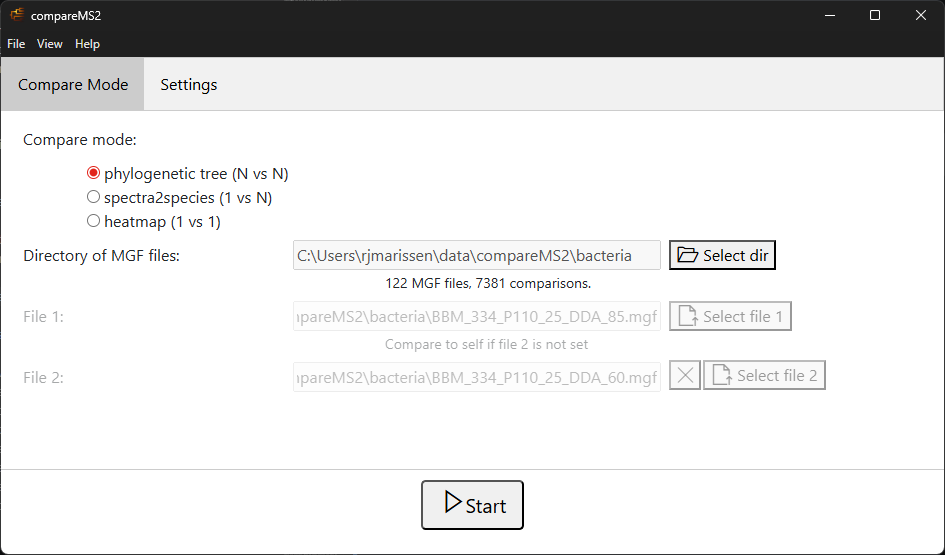
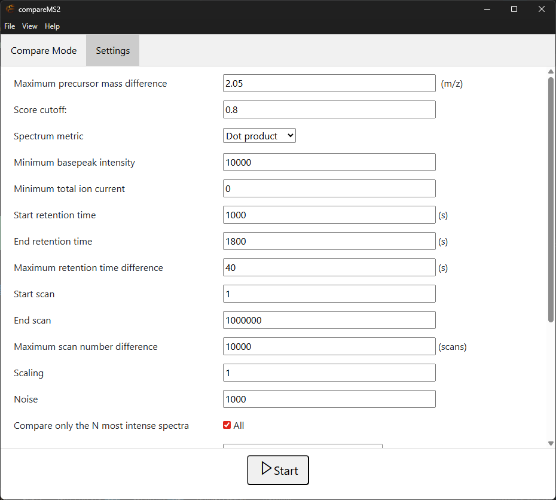
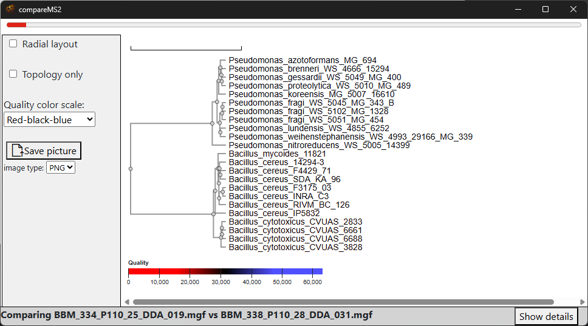
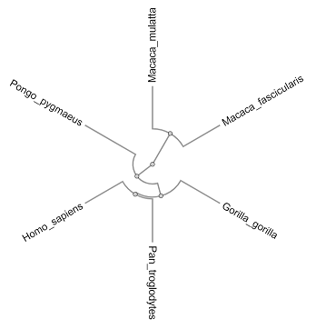
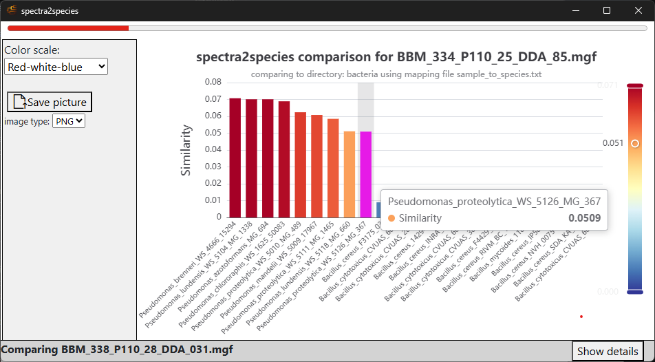
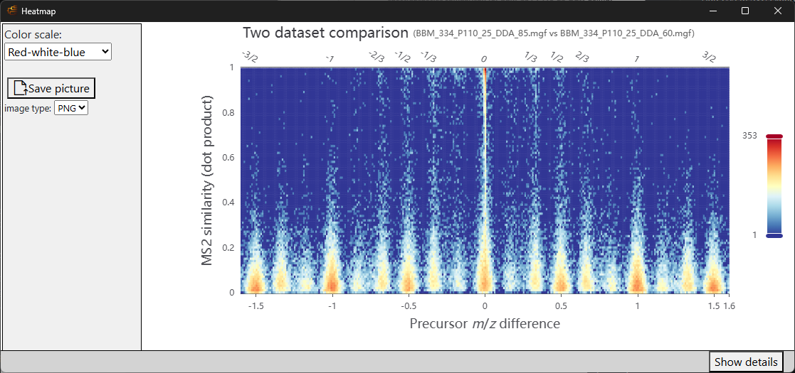
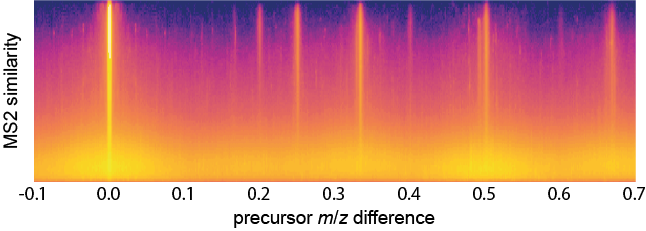

[](https://github.com/524D/compareMS2/releases/latest) [](https://github.com/524D/compareMS2)
[](https://github.com/524D/compareMS2/blob/main/LICENSE.txt) [](https://research-software.nl/software/comparems2) [](https://doi.org/10.5281/zenodo.14990300) [](https://www.bestpractices.dev/projects/10480) [](https://fair-software.eu) [](https://bio.tools/compareMS2)


# compareMS2

compareMS2 calculates the global similarity between tandem mass spectrometry datasets.

[1. Introduction](#1-Introduction)  
&nbsp;&nbsp;&nbsp;&nbsp;&nbsp;[1.1 What is compareMS2?](#11-What-is-compareMS2)  
&nbsp;&nbsp;&nbsp;&nbsp;&nbsp;[1.2 How does compareMS2 differ from other tools?](#12-How-does-compareMS2-differ-from-other-tools)  
&nbsp;&nbsp;&nbsp;&nbsp;&nbsp;[1.3 What can compareMS2 be used for?](#13-What-can-compareMS2-be-used-for)  
[2. Installing compareMS2](#2-Installing-compareMS2)  
&nbsp;&nbsp;&nbsp;&nbsp;&nbsp;[2.1 Running compareMS2 in development mode](#21-Running-compareMS2-in-development-mode)  
&nbsp;&nbsp;&nbsp;&nbsp;&nbsp;[2.2 Building compareMS2](#22-Building-compareMS2)  
[3. Using compareMS2](#3-Using-compareMS2)  
&nbsp;&nbsp;&nbsp;&nbsp;&nbsp;[3.1 Configuring compareMS2](#31-Configuring-compareMS2)  
&nbsp;&nbsp;&nbsp;&nbsp;&nbsp;[3.2 Calculating distance matrices](#32-Calculating-distance-matrices)  
&nbsp;&nbsp;&nbsp;&nbsp;&nbsp;[3.3 Running compareMS2](#33-Running-compareMS2)  
&nbsp;&nbsp;&nbsp;&nbsp;&nbsp;[3.4 Molecular phylogenetics](#34-Molecular-phylogenetics)  
&nbsp;&nbsp;&nbsp;&nbsp;&nbsp;[3.5 Data quality control](#35-Data-quality-control)  
&nbsp;&nbsp;&nbsp;&nbsp;&nbsp;[3.6 Experimental features](#36-Experimental-features)  
[4. compareMS2 tutorial](#4-compareMS2-tutorial)  
[5. Acknowledgements ](#5-Acknowledgements)  
[6. Further reading](#6-Further-reading)  

## 1. Introduction

### 1.1 What is compareMS2?

compareMS2 is a tool for direct comparison of tandem mass spectrometry datasets, typically from liquid chromatography-tandem mass spectrometry (LC-MS/MS), defining similarity as a function of shared (similar) spectra and distance as the inverse of this similarity. Data with identical spectral content thus have similarity 1 and distance 0. The similarity of datasets with no similar spectra tend to 0 (distance +∞) as the size of the sets go to infinity. The extremes of none or all spectra being similar between two LC-MS/MS datasets are unlikely to occur in reality.

### 1.2 How does compareMS2 differ from other tools?

Though compareMS2 is not limited to tandem mass spectra of peptides, it has seen most application to this type of data. There are four broad categories of tools for the analysis of peptide tandem mass spectra in mass spectrometry-based proteomics based on what prior information they utilize. compareMS2 belongs to a class of tools that do not use existing sequence data or libraries of spectra assigned to a specific peptide sequence, but compare tandem mass spectra directly with other tandem mass spectra:

<table>
    <tbody>
        <tr>
            <th rowspan=2 colspan=2></th>
            <th colspan=2>(translated) genome sequences available</th>
        </tr>
        <tr>
            <td>+</td>
            <td>-</td>
        </tr>
        <tr>
            <th rowspan=2>prior/other tandem <br>mass spectra available</th>
            <td>+</td>
            <td>spectral libraries (<a href="https://doi.org/10.1021/ac060279n">BiblioSpec</a>,
                <a href="https://doi.org/10.1002/pmic.200600625">SpectraST</a>, ...)</td>
            <td>direct comparison (<a href="https://doi.org/10.1002/rcm.6162"><b>compareMS2</b></a>,
                <a href="https://doi.org/10.1186/s12859-017-1514-2">DISMS2</a>, ...)</td>
        </tr>
        <tr>
            <td>-</td>
            <td>database search (<a href="https://doi.org/10.1002/(SICI)1522-2683(19991201)20:18<3551::AID-ELPS3551>3.0.CO;2-2">Mascot</a>,
                <a href="https://doi.org/10.1038/msb4100024">Comet</a>, <a href="https://doi.org/10.1021/acs.jproteome.3c00486">Sage</a>, ...)</td>
            <td><i>de novo</i> sequencing (<a href="https://doi.org/10.1002/pro.5560010902">LUTEFISK</a>,
                <a href="https://doi.org/10.1021/ac048788h">PepNovo</a>, ...)</td>
        </tr>
    </tbody>
</table>

### 1.3 What can compareMS2 be used for?

compareMS2 (and similar tools) have extremely broad utility, but have so far seen most utility in data quality control, food/feed species identification and molecular phylogenetics. Molecular phylogenetics is the study of evolution and relatedness of organisms, genes or proteins. The field dates back to [1960](https://doi.org/10.1073/pnas.46.10.1349) using patterns of tryptic peptides separated by paper chromatography. compareMS2 is a [21st-century analogue](https://doi.org/10.1021/acs.jproteome.1c00528), comparing patterns of tryptic peptides as analyzed by tandem mass spectrometry, with the difference that it can use thousands of peptides and that the tandem mass spectra are highly peptide-specific.

However, not only the amino acid sequences of the peptides affect the distance metric in compareMS2, but also the abundance (or coverage) of the proteins. compareMS2 can also be used to quantify the similarity of proteomes from different cell lines or tissues from the same species, before and independently of any protein identification by database or spectral library search.

## 2. Installing compareMS2

The compareMS2 software can be run under Windows (64 bit AMD/Intel), Linux (64 bit AMD/Intel) and MacOS (ARM and Intel).

On Windows and Ubuntu, the easiest way to install compareMS2 is through the [installer](https://github.com/524D/compareMS2/releases/latest/) (under "assets").

Alternatively, and for other platforms, follow the instructions below.

Download/install [NodeJS version 22.22.3](https://nodejs.org/en/download/archive/v22.22.3)
Note: due to a [bug](https://github.com/electron/forge/issues/4277), the currently (June 2026) latest NodeJS version cannot be used.

Activate `yarn` by running `corepack enable`. On Windows, this must be done in a command window with administrator rights (<kbd>win</kbd> -> type `cmd` ->  <kbd>ctrl</kbd>+<kbd>shift</kbd>+<kbd>enter</kbd>)

Then open a new command line windows and run the following on the command line:

```text
git clone https://github.com/524D/compareMS2
cd compareMS2
yarn
```

### 2.1 Running compareMS2 in development mode

To run compareMS2 in "development mode", simply issue:

```text
yarn start
```

For debug mode (enabling Chrome development tools):

```text
CPM_MS2_DEBUG="x" yarn start
```

### 2.2 Building compareMS2

To build a distributable package (for the platform on which this command is executed):

```text
yarn make
```

For example, the resulting Windows installer can than be found (relative to the compareMS2 main directory) in
`out\make\squirrel.windows\x64\`.

## 3. Using compareMS2

compareMS2 can be used both from the command-line interface (CLI) and through the compareMS2 Graphical User Interface (GUI). This section describes the use of the GUI.

From the GUI, 3 different visualizations can be produced from MS2 data.

1) Phylogenetic tree: A set of MS2 data files are compared, and the distances between them are combined into a phylogenetic tree.
2) spectra2species: One MS2 data file is compared to a set of other files. The distance is represented as a bar graph, and is an indication of how close the respective samples are.
3) Heatmap: An MS2 data file is compared to itself or to another. The distribution of the inner products of the spectra is represented in a heatmap. This gives an overview of many properties of the MS2 spectra, such as charge stated, mass accuracy, and similarity (in case two different files are compared).

### 3.1. Main screen

The visualization and input data are selected on the main screen



Depending on the selected "Compare mode", only the relevant file selection and other user interface items
are accessible, while the items that are not useful for the selected mode are greyed out.

In "settings" tab, instrument specific settings, output format and related items can be set.



#### 3.1.1. Sample to species file

One setting that deserves special attention is the "Sample to species file". This file
maps file names to species names. If this file is present, the GUI will display the
name of the species instead of the name of the sample file. Furthermore, it allows multiple
sample files for the same species. In the comparisons, the results of all samples files for the same species are then averaged.

The content of the "Sample to species file" must a plain text file. Each line should contain a filename
and a species name, separated by a TAB character. If the directory with samples contains
a file with the exact name "spectra_to_species.txt", that file is automatically selected.
CompareMS also works without "spectra_to_species.txt file". Also, not all species or files that are listed have to be present in the data set.

### 3.2. Phylogenetic tree

Selecting "phylogenetic tree" and pressing "start" results in a phylogenetic tree being generated.



The compareMS2 GUI provides real-time feedback by continuously updating the distance matrix, and drawing a UPGMA tree at the completion of each row in the (lower triangular) distance matrix.

Every phylogenetic compareMS2 analysis consists of two phases: (1) pairwise comparison of all LC-MS/MS datasets and (2) calculating a distance matrix from all pairwise comparisons. The compareMS2 GUI provides real-time feedback by continuously updating the distance matrix, and drawing a UPGMA tree at the completion of each row in the (lower triangular) distance matrix. The default distance metric D is symmetric, i.e. the distance from dataset A to dataset B is identical to the distance from dataset B to dataset A. If the distance D(A, B) has already been calculated, there is no need to calculate D(B, A). As every dataset is identical to itself, there is no point in calculating D(A, A) or D(B, B), as these are always zero.

  
Figure 1. Phylogenetic tree based on sample primate [sera datasets](https://osf.io/sg796/) of 1,000 tandem mass spectra, as displayed during a compareMS2 run. This is a good test dataset for compareMS2.

See PRIDE Project [PXD034932](https://www.ebi.ac.uk/pride/archive/projects/PXD034932) for additional compareMS2 test data.

### 3.3 spectra2species

Selecting "spectra2species" and pressing "start" results in a spectra2species bar chart being generated.



In spectra2species mode, a single MGF file is compared to a collection of other MFG files. This gives a fast
indication of the similarity of a sample to other samples, and thus can help to identify the species of
an unknown sample.

### 3.4 Heatmap

Selecting "Heatmap" and pressing "start" results in a heatmap being generated.



The heatmap can be computed for a single file, giving an indication of the charge states, noise level,
and other quality measures of the data.

Also, it's possible to generate a heatmap based on two files. In addition the results for a single file, this
shows the similarity of the two files.

### 3.5 Configuring compareMS2  

The compareMS2 GUI can be configured using command line switches.
These are similar t0 the command line switches of the
command line switches of the underlying [compareMS command line program](https://github.com/524D/compareMS2-cmd).


-h,--help  *print usage message*  
-W,--scan-range  *first scan number,last scan number*    
-R,--rt-range  *first retention time*,*last retention time*  
-c,--cutoff *score cutoff*  
-o,--output *output basename*
-m,--min-intensity *min base peak intensity,min total ion current*  
-w,--max-scan-diff *maximum scan number difference*  
-r,--max-rt-diff *maximum retention time difference*
-p,--max-precursor-diff *maximum difference in precursor mass*  
-s,--scaling *scaling power*  
-n,--noise  *noise threshold*  
-d,--metric *distance metric (0, 1 or 2)*
-q,--qc *QC measure*  
\[MGF directory name\]  
\[Filename 1\]  
\[Filename 2\]

For the final directory/filename arguments, compareMS2 checks
if the argument is a directory of a file to determine its use.
This way, a directory and/or file can simply be dragged onto the
compareMS2 program icon to set these values.

### 3.6 Calculating distance matrices

Distance matrices are calculated using a separate executable, compareMS2_to_distance_matrices. This can also average the distances for multiple replicates per species for more accurate molecular phylogenetic analysis. For this, a tab-delimited file with filenames and species names are required. If no such file is provided, one is created automatically, using the filenames as sample "species". The distance matrix can currently be saved in the MEGA or Nexus formats. [MEGA](https://www.megasoftware.net/) is recommended for creating trees from compareMS2 results.

### 3.7 Running compareMS2

After specifying the parameters, click on the "Start" button to run compareMS2 on all files in the specified directory. Alternatively, compareMS2 can be run on two specific files using the CLI version.

### 3.8 Molecular phylogenetics

We recommend [MEGA](https://www.megasoftware.net/) creating phylogenetic trees from compareMS2 results. However, most phylogenetic software can take distance matrices as input for UPGMA analysis. This was the original use for which compareMS2 was developed, see the [2012 paper](https://doi.org/10.1002/rcm.6162).

### 3.9 Data quality control

compareMS2 provides a very quick overview of large number of datasets to see if they cluster as expected or if there are outliers. Data of lower quality can thus be detected *before* running them through a data analysis pipeline and statistical analysis. It is not absolutely necessary to include all spectra in the analysis - major discrepancies should be detectable with ~1,000 spectra, if selected systematically. Similarly, compareMS2 can be used to determine the relative importance of factors in sample preparation and analysis, as shown in a [2016 paper](https://doi.org/10.1002/rcm.7494).

In addition, compareMS2 collects metadata on each dataset (by default the number of tandem mass spectra) and visualizes this on top of the hierarcical clustering or phylogenetic tree.

### 3.10 Experimental features

Starting in version 2.0, we have begun to include experimental features in compareMS2. These are only available on the command line, but allow extraction of additional information from the comparisons, such as the distribution of similarity between tandem mass spectra as function of precursor mass measurement error, allowing identification of isotope errors and charge state distributions *before* any database search:

  
Figure 2. Similarity (spectral angle from 0 to 1) of tandem mass spectra plotted against precursor *m*/*z* difference, revealing isotope errors up to at least 2 (corresponding to bands at *m*/*z* difference 2/3 and 2/5) and charge states up to 6 (corresponding to the band at *m*/*z* difference 1/6).

## 4. compareMS2 tutorial

A compareMS2 workshop was held at the [EuBIC Winter School in Winterberg, Germany, January 15-19 2024](https://eubic-ms.org/events/2024-winter-school/). Some of the slides from this workshops can be found [here](https://osf.io/8qjwz), along with a tutorial [here](https://osf.io/e5j7q). All data for the tutorial are also available on [OSF](https://osf.io/sjtrm/).

## 5. Acknowledgements

The developers wish to thank Dr. Michael Dondrup at the University of Bergen for providing changes and additions to make compareMS2 work under macOS. All users and beta testers are also acknowledged for their valuable feedback that helped to improve compareMS2.

## 6. Further reading

compareMS2 and related applications have been described or used in a number of papers:

Shotgun Proteomics Protocol for Insects, Varunjikar MS, Belghit I, Oveland E, Palmblad M and Rasinger JD, *Methods Mol. Biol.* **2884**:81-98, 2025, [doi.org/10.1007/978-1-0716-4298-6_7](https://doi.org/10.1007/978-1-0716-4298-6_7)

Fish species authentication in commercial fish products using mass spectrometry and spectral library matching approach, Varunjikar MS, Pineda-Pampliega J, Belghit I, Palmblad M, Einar Grøsvik B, Meier S, Asgeir Olsvik P, Lie KK and Rasinger JD, *Food Res. Int.* **192**:114785, 2024, [doi.org/10.1016/j.foodres.2024.114785](https://doi.org/10.1016/j.foodres.2024.114785)

compareMS2 2.0: An Improved Software for Comparing Tandem Mass Spectrometry Datasets, Marissen M, Varunjikar MS, Laros JFJ, Rasinger JD, Neely BA and Palmblad M, *J. Proteome Res.*  **22(2)**:514–519, 2023, [doi.org/10.1021/acs.jproteome.2c00457](https://doi.org/10.1021/acs.jproteome.2c00457)

Multi-tissue proteogenomic analysis for mechanistic toxicology studies in non-model species, Lin MS, Varunjikar MS, Lie KK, Søfteland L, Dellafiora L, Ørnsrud R, Sanden M, Berntssen MHG, Dorne JLCM, Bafna V and Rasinger JD, *Environment International* **182**:108309, 2023 [https://doi.org/10.1016/j.envint.2023.108309 ](https://doi.org/10.1016/j.envint.2023.108309 )

Unveiling the potential of proteomics in addressing food and feed safety challenges, Perkons I, Varunjikar MS and Rasinger JD, *EFSA Journal* **21(Suppl 1)**:e211013, 2023 [https://doi.org/10.2903/j.efsa.2023.e211013 ](https://doi.org/10.2903/j.efsa.2023.e211013 )

Shotgun proteomics approaches for authentication, biological analyses, and allergen detection in feed and food-grade insect species, Varunjikar MS, Belghit I, Gjerde J, Palmblad M, Oveland E and Rasinger JD, *Food Control* **131**, 2022, [doi.org/10.1016/j.foodcont.2022.108888](https://doi.org/10.1016/j.foodcont.2022.108888)

Comparing novel shotgun DNA sequencing and state-of-the-art proteomics approaches for authentication of fish species in mixed samples, Varunjikar MS, Moreno-Ibarguen C, Andrade-Martinez JS, Tung HS, Belghit I, Palmblad M, Olsvik PA, Reyes A, Rasinger JD and Lie KK, *Food Control* **131**:108417, 2022, [doi.org/10.1016/j.foodcont.2021.108417](https://doi.org/10.1016/j.foodcont.2021.108417)

Rewinding the molecular clock: looking at pioneering molecular phylogenetics experiments in the light of proteomics, Neely B and Palmblad M, *J. Proteome Res.* **20(10)**:4640-4645, 2021, [doi.org/10.1021/acs.jproteome.1c00528](https://doi.org/10.1021/acs.jproteome.1c00528)

Future feed control – Tracing banned bovine material in insect meal. Belghit I, Varunjikar M, Lecrenier MC, Steinhilber A, Niedzwiecka A, Wang YV, Dieu M, Azzollini D, Lie K, Lock EJ, Berntssen MHG, Renard P, Zagon J, Fumière O, van Loon JJA, Larsen T, Poetz O, Braeuning A, Palmblad M and Rasinger JD, *Food Control* **128**:108183, 2021, [doi.org/10.1016/j.foodcont.2021.108183](https://doi.org/10.1016/j.foodcont.2021.108183)

Species-Specific Discrimination of Insect Meals for Aquafeeds by Direct Comparison of Tandem Mass Spectra. Belghit I, Lock EJ, Fumière O, Lecrenier MC, Renard P, Dieu M, Berntssen MHG, Palmblad M and Rasinger JD, *Animals* **9(5)**:222, 2019 [doi.org/10.3390/ani9050222](https://doi.org/10.3390/ani9050222)

Palaeoproteomics of bird bones for taxonomic classification. Horn IR, Kenens Y, Palmblad M, van der Plas-Duivesteijn SJ, Langeveld BW, Meijer HJM, Dalebout H, Marissen RJ, Fischer A, Vincent Florens FB, Niemann J, Rijsdijk KF, Schulp AS, Laros JFJ and Gravendeel B, *Zoological Journal of the Linnean Society* **186(3)**:650–665, 2019, [doi.org/10.1093/zoolinnean/zlz012](https://doi.org/10.1093/zoolinnean/zlz012)

Species and tissues specific differentiation of processed animal proteins in aquafeeds using proteomics tools. Rasinger JD, Marbaix H, Dieu M, Fumière O, Mauro S, Palmblad M, Raes M and Berntssen MHG, *J. Proteomics* **147**:125-131, 2016, [doi.org/10.1016/j.jprot.2016.05.036](https://doi.org/10.1016/j.jprot.2016.05.036)   

Authentication of closely related fish and derived fish products using tandem mass spectrometry and spectral library matching. Nessen M, van der Zwaan D, Greevers S, Dalebout H, Staats M, Kok E and Palmblad M, *J. Agric. Food Chem.* **64(18)**:3669-3677, 2016, [doi.org/10.1021/acs.jafc.5b05322](https://doi.org/10.1021/acs.jafc.5b05322)

Identification of meat products by shotgun spectral matching. Ohana D, Dalebout H, Marissen RJ, Wulff J, Bergquist J, Deelder AM and Palmblad M, *Food Chem.* **203**:28-34, 2016, [doi.org/10.1016/j.foodchem.2016.01.138](https://doi.org/10.1016/j.foodchem.2016.01.138)   

Differentiating samples and experimental protocols by direct comparison of tandem mass spectra. van der Plas-Duivesteijn SJ, Wulff T, Klychnikov O, Ohana D, Dalebout H, van Veelen PA, de Keijzer J, Nessen MA, van der Burgt YEM, Deelder AM and Palmblad M, *Rapid Commun. Mass Spectrom.* **30**:731-738, 2016, [doi.org/10.1002/rcm.7494](https://doi.org/10.1002/rcm.7494) 

Identifying Proteins in Zebrafish Embryos Using Spectral Libraries Generated from Dissected Adult Organs and Tissues. van der Plas-Duivesteijn SJ, Mohammed Y, Dalebout H, Meijer A, Botermans A, Hoogendijk JL, Henneman AA, Deelder AM, Spaink HP and Palmblad M, *J. Proteome Res.* **13(3)**:1537-1544, 2014, [doi.org/10.1021/pr4010585](https://doi.org/10.1021/pr4010585)

Authentication of Fish Products by Large-Scale Comparison of Tandem Mass Spectra. Wulff  T, Nielsen ME, Deelder AM, Jessen F and Palmblad M, *J. Proteome Res.* **12(11)**:5253-5259, 2013, [doi.org/10.1021/pr4006525](https://doi.org/10.1021/pr4006525)

Molecular phylogenetics by direct comparison of tandem mass spectra. Palmblad M and Deelder AM, *Rapid Commun. Mass Spectrom.* **26(7)**:728-732, 2012, [doi.org/10.1002/rcm.6162](https://doi.org/10.1002/rcm.6162)
